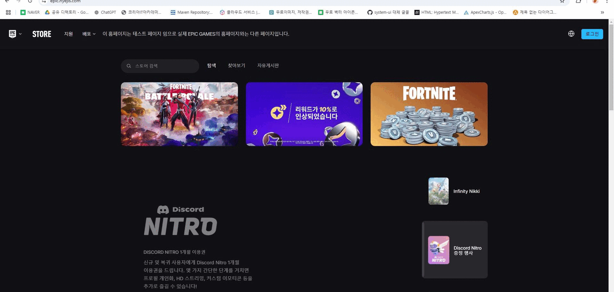
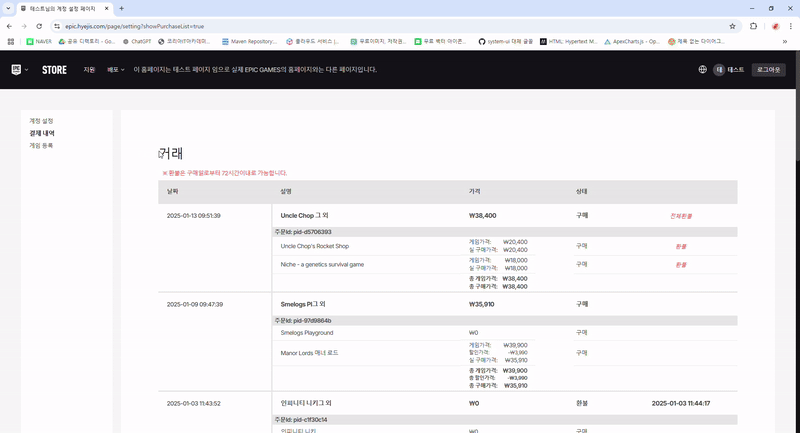

# 에픽게임즈 클론 웹 사이트 epic-project

## 🖥️ 프로젝트 소개

에픽(Epic Games) 웹사이트의 구조와 UI를 분석하여 실제 서비스와 유사한 디자인과 기능 구현한 프로젝트입니다.

에픽게임즈 사이트를 선정한 이유는 다양한 기능(회원, 상세, 결제 등)을 구현하며 실무와 유사한 웹 개발 경험을 쌓기에 적합하다고 생각 하였습니다.   
또한, 사용자 친화적인 UI/UX 설계를 학습하고 확장성 있는 시스템을 구현하는 데 좋은 사례라고 생각하여 선정했습니다.

  

## 📅 개발 기간

- 2024.12.01 ~ 2024.12.31

## 👥 팀원

**송승원** 
- 깃허브 주소
- 포토폴리오 주소
- 배포 주소

**서혜지**
- 깃허브 주소
--- [https://github.com/mnuw2626](https://github.com/mnuw2626)

- 포토폴리오 주소
--- [https://hyejis.com](https://hyejis.com)

- 배포 주소
--- [https://epic.hyejis.com](https://epic.hyejis.com)

**장지수**
- 깃허브 주소
- 포토폴리오 주소
- 배포 주소

## 🛠️ 개발 환경

- ### Frontend

  
  
  
  

- ### Backend

  
  
  

- ### Tool

  

- ### Collaboration

  
  

- ### Deployment
  
  

  
## 📋 E-R / Flow Chat

  

<h3>🗃️ E-R</h3>

 

<h3>⌛ Flow Chat</h3>

## 💡 주요 기능

### 로그인 / 회원 가입 기능

### 게임 구매 기능
<table>
  <tr>
    <th>결제 기능</th>
    <th>환불 기능</th>
  </tr>
  <tr>
    <td>
        
    </td>
    <td>
      
    </td>
  </tr>
</table>
<table>
  <tr>
    <th>위시리스트 & 장바구니 기능</th>
  </tr>
  <tr>
    <td>
      
    </td>
  </tr>
</table>

### 리뷰 기능

